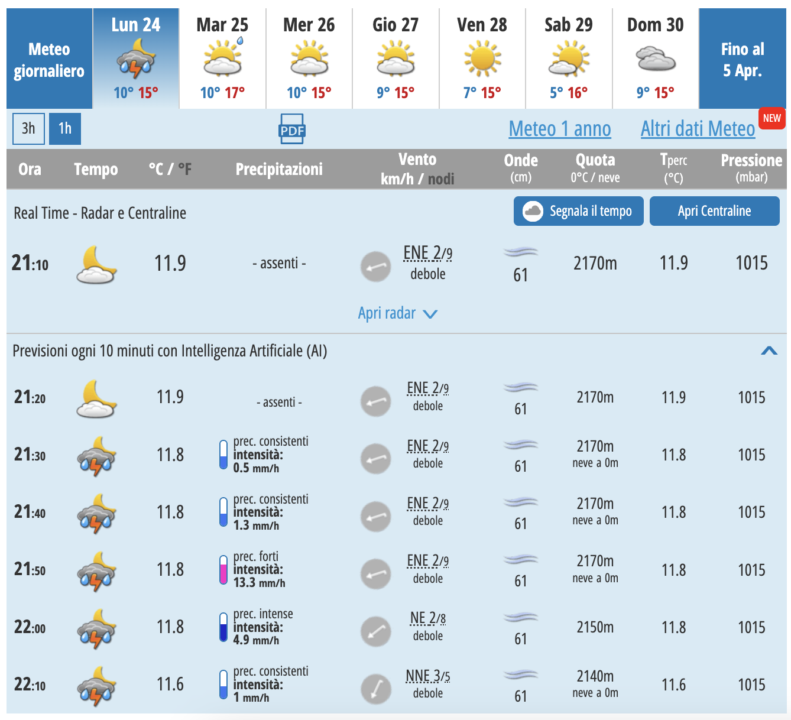
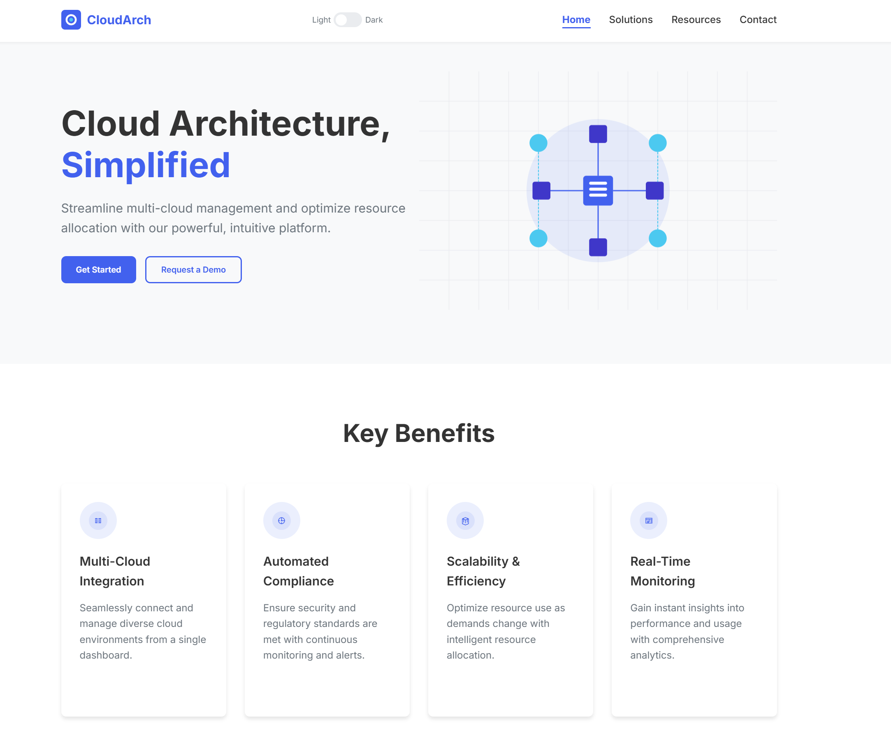
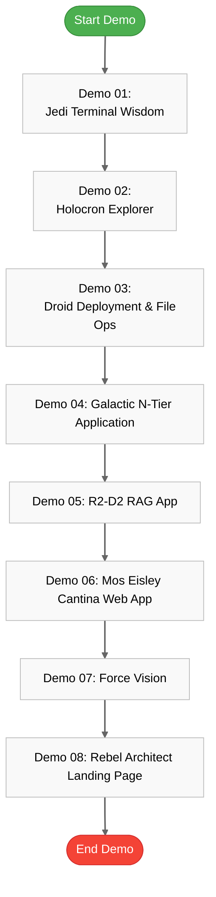

# 🚀 GitHub Copilot: The Code Awakens

> **🎯 Purpose**: This guide covers 8 hands-on Star Wars-themed demos showcasing GitHub Copilot's capabilities, GitHub Copilot for Azure integration, and the new agent mode for technical audiences.

## 📋 Table of Contents

- [🚀 GitHub Copilot: The Code Awakens](#-github-copilot-the-code-awakens)
  - [📋 Table of Contents](#-table-of-contents)
  - [💻 Demo 01: Jedi Terminal Wisdom](#-demo-01-jedi-terminal-wisdom)
  - [🌐 Demo 02: Holocron Explorer](#-demo-02-holocron-explorer)
  - [🛠️ Demo 03: Droid Deployment \& File Ops](#️-demo-03-droid-deployment--file-ops)
    - [Part A: Azure Extension](#part-a-azure-extension)
    - [Part B: File Operations Script](#part-b-file-operations-script)
  - [🗄️ Demo 04: Galactic N-Tier Application](#️-demo-04-galactic-n-tier-application)
  - [🧠 Demo 05: R2-D2 RAG App](#-demo-05-r2-d2-rag-app)
  - [☕ Demo 06: Mos Eisley Cantina Web App](#-demo-06-mos-eisley-cantina-web-app)
  - [👁️ Demo 07: Force Vision](#️-demo-07-force-vision)
  - [🏗️ Demo 08: Rebel Architect Landing Page](#️-demo-08-rebel-architect-landing-page)
  - [📝 Demo Preparation Checklist](#-demo-preparation-checklist)
  - [📊 Demo Flow Visualization](#-demo-flow-visualization)
  - [🔑 Key Reminders](#-key-reminders)

---

## 💻 Demo 01: Jedi Terminal Wisdom

**Mode**: Ask mode

**Prompt**:
```
gh copilot explain sudo apt-get
```

**Expected Output**:
A clear, natural language explanation of the `sudo apt-get` command, including its purpose, common flags (e.g., `update`, `upgrade`, `install`, `remove`), and typical use cases.

**Purpose**:  
Demonstrate how GitHub Copilot CLI can explain complex shell commands in natural language, enhancing developer understanding of terminal operations.

**Key Capability**: Command-line interpretation and contextual explanation.

---

## 🌐 Demo 02: Holocron Explorer

**Mode**: Ask mode

**Prompts**:
```
explain repository
fix code
```

**Expected Output**:
1.  **Repository Explanation**: A summary of the repository's structure, primary language, key dependencies, and overall purpose.
2.  **Code Fix**: Identification of potential issues in a selected code block or a suggested refactoring/improvement, along with an explanation of the proposed changes.

**Purpose**:  
Showcase GitHub Copilot's web interface capabilities for repository exploration and automatic code corrections directly in the browser.

**Key Capability**: Repository analysis, code diagnostics, and automated code refinement.

---

## 🛠️ Demo 03: Droid Deployment & File Ops
### Part A: Azure Extension

**Mode**: Copilot for Azure

**Prompts**:
```
Could you help me create and deploy a simple Flask website by using an azd template?
@azure Before I execute azd init, what does it do?
@azure What resources are created with this template?
@azure Are there any cost-saving tips for running this app on Azure?
@azure how can i make this application highly available?
@azure How do I undeploy this website?
```

**Expected Output**:
- Step-by-step guidance for initializing an `azd` template and deploying a Flask application to Azure.
- Clear explanations of `azd` commands and the Azure resources being provisioned.
- Actionable advice on cost optimization and high availability for the deployed application.
- Instructions for de-provisioning the Azure resources.

**Key Capability**: Azure deployment guidance, `azd` workflow assistance, and Azure best practices consultation.

### Part B: File Operations Script

**Mode**: Ask mode

**Boosted Prompt**:
```
I need 1 powershell script to create 100 random folders with 100 random files; file size must vary between a few kb to a max 50mb.
I need another powershell script to automate file operations such as copying, moving, deleting, compressing, and extracting while capturing metrics for each operation, including duration, data size, and throughput. Operations should be split into 2 options - 1 for copying, moving, deleting; 2 for compressing, and extracting.
```

**Expected Output**:
- Two functional PowerShell scripts:
    1.  A script to generate a specified number of folders and files with random sizes.
    2.  A script to perform file operations (copy, move, delete, compress, extract) with performance metrics logging.

**Purpose**:  
Demonstrate Copilot for Azure's assistance with deployment workflows and advanced PowerShell scripting capabilities for automation tasks.

**Key Capability**: Complex script generation (PowerShell), task automation logic, and integration of performance metrics.

---

## 🗄️ Demo 04: Galactic N-Tier Application

**Mode**: Ask mode, Edit Mode, Agent mode

**Prompts**:
```
git clone https://github.com/Azure-Samples/azure-sql-db-django
@azure Please recommend Azure services for my project.
@azure Please use Azure App Service instead of Azure Container App for my project.
@azure Why would I use Azure Cosmos DB instead of Azure SQL?
@azure replace the sql db with a Cosmos DB
@azure The SERVICE_URL value should be bing.com; also add an environment variable STAGE=dev to my project.
@azure Let's use GitHub to deploy my app to Azure. Set up a GitHub Actions pipeline to deploy my app to Azure.
```

**Reminders**:
- ⚠️ **Switch model!** Can I get well architected recommendations for my app?
- ⚠️ **Switch to agent mode** 

**Boosted Agent Mode Prompt**:
```
update the readme file so that it has more info including structure and purpose and also add a mermaid chart
```

**Expected Output**:
- Recommendations for Azure services suitable for the Django application.
- Explanation of the benefits of Cosmos DB over Azure SQL for specific scenarios.
- Guided code modifications to migrate the Django app from Azure SQL to Cosmos DB.
- Assistance in configuring Azure App Service environment variables.
- A generated GitHub Actions workflow file for CI/CD.
- An updated README file with project details and a Mermaid architecture diagram.

**Purpose**:  
Showcase Copilot's ability to guide architectural decisions, database migrations, environment configuration, and CICD setup with different levels of intelligent assistance.

**Key Capability**: Architectural guidance, database migration assistance, multi-step code modification, CI/CD pipeline generation, and documentation update (Agent Mode).

---

## 🧠 Demo 05: R2-D2 RAG App

**Mode**: Copilot for Azure

**Prompts**:
```
@azure i want to build a RAG app using next.js and llamaindex.ts. Can you help me find a sample and deploy it to aca?
lnk https://github.com/Azure-Samples/llama-index-javascript
azd up
```
- 💡 **Pro Tip**: Consider using the [Prompt Boost](https://marketplace.visualstudio.com/items?itemName=chrisdias.promptboost) extension to enhance your prompt.

**Boosted Prompt**:
```
Use the code from https://github.com/Azure-Samples/llama-index-javascript and guide me through deploying it to Azure, following these best practices:

Clone and set up the sample application.
Configure required environment variables (including Azure OpenAI credentials).
Test the app locally to ensure it works.
Deploy to Azure using a recommended method (App Service, Container Apps, or Static Web Apps).
Apply Azure best practices: use managed identities, store secrets in Azure Key Vault, enable monitoring/logging, and use deployment slots if available.
Provide step-by-step PowerShell commands for Windows.
Highlight any prerequisites or Azure resource setup needed.
```

**Expected Output**:
- Guidance on finding and cloning the sample RAG application.
- Step-by-step instructions for configuring environment variables, including Azure OpenAI credentials.
- Assistance with local testing procedures.
- A recommended Azure deployment strategy (e.g., Azure Container Apps).
- PowerShell commands for each step of the setup and deployment process.
- Clear articulation of Azure best practices (Managed Identities, Key Vault, Monitoring, Deployment Slots) applied to the RAG application.

**Purpose**:  
Demonstrate Copilot's ability to guide through modern AI application deployment following Azure best practices.

**Key Capability**: AI application deployment guidance, Azure best practices integration, environment configuration for AI services, and step-by-step procedural instruction.

---

## ☕ Demo 06: Mos Eisley Cantina Web App

**Mode**: Agent mode

**Prompts**:
```
I am the owner of a coffee shop in Amsterdam. Iwant to create a web app in app service.
```

**Boosted Prompt**:
```
I am the owner of a coffee shop in Amsterdam.
@azure i want to create a web app in app service.
i will use this web app to take orders of coffee from my customers.
customer data will be stored in azure sql database. the database will store first name, last name, username, email, preferred delivery address, marketing preference.
the web app must be vnet integrated and use the second cheapest tier. i want to use dot net core and integrate my app with application insights.
all secrets must be stored in keyvault.
the code you will create must be in bicep, and you have to apply best practices.
you need to include a github cicd pipeline, a markdown file explaining the pipeline and instructions how to configure it plus a mermaid chart which displays the entire flow.
i need you to design my website. remember that my site is for customers to order coffee. add the following: a catchy title, a description, a sign up form, an order form, an option to join a marketing list.
you need to find and add relevant images. you need to help me upload these files to my site.
```

**Additional Prompts**:
```
help me deploy this to azure in Sweden central
```

**Expected Output**:
- Bicep templates for the Azure infrastructure (App Service with VNet integration, Azure SQL Database, Key Vault, Application Insights).
- .NET Core application code for the coffee shop web app, including frontend (HTML/CSS/JS for forms and layout) and backend logic for order processing and database interaction.
- A GitHub Actions CI/CD pipeline YAML file.
- A Markdown file explaining the pipeline setup and deployment instructions.
- A Mermaid diagram visualizing the application architecture and deployment flow.
- Guidance on deploying to a specific Azure region (Sweden Central) and setting up GitHub Dependabot.

**Purpose**:  
Showcase full-stack application design, infrastructure-as-code with Bicep, CICD pipeline setup, and deployment best practices.

**Key Capability**: Full-stack application generation, Infrastructure-as-Code (Bicep), CI/CD pipeline design, UI/UX considerations, and integration of multiple Azure services.

---

## 👁️ Demo 07: Force Vision

**Mode**: Agent mode

**Prompt**:
```
help me create weather app similar to this picture. this application will be deployed in azure web apps.
```

**Image**:


**Expected Output**:
- A .NET Core application code structure for a weather app, including models for weather data, user interface components, and API endpoints.
- A Bicep template for deploying the application to Azure Web Apps, including necessary resources (App Service, Storage Account, etc.).

**Purpose**:  
Demonstrate Copilot's vision capabilities to analyze UI designs or architectural diagrams and generate corresponding application code for Azure deployment.

**Key Capability**: Visual information processing, code generation from images, and mapping UI concepts to application logic.

---

## 🏗️ Demo 08: Rebel Architect Landing Page

**Mode**: Agent mode

**Prompt**:
```
Create a PRD which which describes a web page for cloud architects in simple MVP terms.
Layout should be simple and easy to navigate. It should be similar to this image.
Create a web page based on the PRD and the image.
```

**Image**:


**Expected Output**:
- A Product Requirements Document (PRD) outlining the structure and content of a landing page for cloud architects.
- Sections including:
  - **Hero Section**: Engaging headline, subheadline, and call-to-action (CTA).
  - **Technical Resources**: Links to whitepapers, case studies, and technical documentation.
  - **Case Studies**: Success stories or testimonials from cloud architects.
  - **Value Propositions**: Key benefits of the product or service tailored to cloud architects.
  - **CTAs**: Clear actions for users (e.g., "Get Started", "Request a Demo").
  - **Design Considerations**: Recommendations for layout, color scheme, and typography suitable for a technical audience.
  - **Code**: HTML/CSS code for the landing page, including responsive design elements and accessibility considerations. A complete HTML/CSS implementation of the landing page based on the PRD and image.

**Purpose**:  
Show Copilot's content generation capabilities for specialized technical audiences, extending beyond code to marketing and product description tasks.

**Key Capability**: Specialized content generation, MVP definition, target audience understanding, and technical marketing concepts.

---

## 📝 Demo Preparation Checklist

- [ ] Ensure all required extensions are installed:
  - GitHub Copilot
  - GitHub Copilot Chat
  - GitHub Copilot for Azure
  - Azure Tools
  
- [ ] Test each demo prompt before the presentation
- [ ] Prepare sample repositories and code snippets
- [ ] Verify Azure subscription access and permissions
- [ ] Practice switching between different models and modes:
  - Standard mode
  - Edit mode  
  - Agent mode
  - Vision mode

## 📊 Demo Flow Visualization



## 🔑 Key Reminders

- **Model Switching** 🔄: Switch models when more comprehensive architecture recommendations are needed
- **Mode Switching** 🔀:
  - Ask: Quick code insights and explanations
  - Edit: Direct code modifications
  - Agent: Multi-step tasks and complex problem solving
  - Vision: Analyze visual content and generate code
- **Prefixes** 📌:
  - `@azure` for Azure-specific assistance
- **Boosted Prompts** 🚀: Use for more comprehensive, best-practice solutions