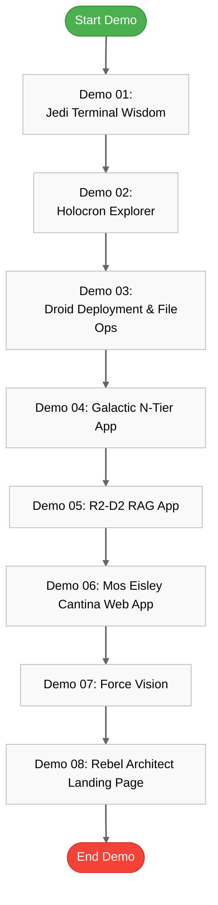

# 🚀 GitHub Copilot & GitHub Copilot for Azure: Star Wars Demo Guide

> **🎯 Purpose**: This guide covers 8 hands-on Star Wars-themed demos showcasing GitHub Copilot's capabilities, GitHub Copilot for Azure integration, and the new agent mode for technical audiences.

## 📋 Table of Contents

- [🚀 GitHub Copilot \& GitHub Copilot for Azure: Star Wars Demo Guide](#-github-copilot--github-copilot-for-azure-star-wars-demo-guide)
  - [📋 Table of Contents](#-table-of-contents)
  - [💻 Demo 01: Jedi Terminal Wisdom (GitHub Copilot CLI)](#-demo-01-jedi-terminal-wisdom-github-copilot-cli)
  - [🌐 Demo 02: Holocron Explorer (GitHub Copilot for Web)](#-demo-02-holocron-explorer-github-copilot-for-web)
  - [🛠️ Demo 03: Droid Deployment \& File Ops (Azure Extension \& File Ops Script)](#️-demo-03-droid-deployment--file-ops-azure-extension--file-ops-script)
    - [Part A: Azure Extension](#part-a-azure-extension)
    - [Part B: File Operations Script](#part-b-file-operations-script)
  - [🗄️ Demo 04: Galactic N-Tier App (Azure SQL \& Cosmos DB)](#️-demo-04-galactic-n-tier-app-azure-sql--cosmos-db)
  - [🧠 Demo 05: R2-D2 RAG App (Next.js \& LlamaIndex)](#-demo-05-r2-d2-rag-app-nextjs--llamaindex)
  - [☕ Demo 06: Mos Eisley Cantina Web App (Azure)](#-demo-06-mos-eisley-cantina-web-app-azure)
  - [👁️ Demo 07: Force Vision - .NET Core Chat App](#️-demo-07-force-vision---net-core-chat-app)
  - [🏗️ Demo 08: Rebel Architect Landing Page](#️-demo-08-rebel-architect-landing-page)
  - [📝 Demo Preparation Checklist](#-demo-preparation-checklist)
  - [📊 Demo Flow Visualization](#-demo-flow-visualization)
  - [🔑 Key Reminders](#-key-reminders)

---

## 💻 Demo 01: Jedi Terminal Wisdom (GitHub Copilot CLI)

**Mode**: Standard

**Prompt**:
```
gh copilot explain sudo apt-get
```

**Purpose**:  
Demonstrate how GitHub Copilot CLI can explain complex shell commands in natural language, enhancing developer understanding of terminal operations.

---

## 🌐 Demo 02: Holocron Explorer (GitHub Copilot for Web)

**Mode**: Standard

**Prompts**:
```
explain repository
fix code/action
```

**Purpose**:  
Showcase GitHub Copilot's web interface capabilities for repository exploration and automatic code corrections directly in the browser.

---

## 🛠️ Demo 03: Droid Deployment & File Ops (Azure Extension & File Ops Script)

### Part A: Azure Extension

**Mode**: Copilot for Azure

**Prompts**:
```
Could you help me create and deploy a simple Flask website by using an azd template?
@azure Before I execute azd init, what does it do?
@azure What resources are created with this template?
@azure Are there any cost-saving tips for running this app on Azure?
@azure how can i make this application highly available?
@azure How do I undeploy this website?
```

### Part B: File Operations Script

**Mode**: Standard → Boosted

**Boosted Prompt**:
```
I need 1 powershell script to create 100 random folders with 100 random files; file size must vary between a few kb to a max 50mb.
I need another powershell script to automate file operations such as copying, moving, deleting, compressing, and extracting while capturing metrics for each operation, including duration, data size, and throughput. Operations should be split into 2 options - 1 for copying, moving, deleting; 2 for compressing, and extracting.
```

**Purpose**:  
Demonstrate Copilot for Azure's assistance with deployment workflows and advanced PowerShell scripting capabilities for automation tasks.

---

## 🗄️ Demo 04: Galactic N-Tier App (Azure SQL & Cosmos DB)

**Mode**: Copilot for Azure → Switch Model → Switch to Agent Mode

**Prompts**:
```
git clone https://github.com/Azure-Samples/azure-sql-db-django
@azure Please recommend Azure services for my project.
@azure Please use Azure App Service instead of Azure Container App for my project.
@azure Why would I use Azure Cosmos DB instead of Azure SQL?
@azure replace the sql db with a Cosmos DB
@azure The SERVICE_URL value should be bing.com; also add an environment variable STAGE=dev to my project.
@azure Let's use GitHub to deploy my app to Azure. Set up a GitHub Actions pipeline to deploy my app to Azure.
```

**Reminders**:
- ⚠️ **Switch model!** Can I get well architected recommendations for my app?
- ⚠️ **Switch to agent mode** 

**Boosted Agent Mode Prompt**:
```
update the readme file so that it has more info including structure and purpose and also add a mermaid chart
```

**Purpose**:  
Showcase Copilot's ability to guide architectural decisions, database migrations, environment configuration, and CICD setup with different levels of intelligent assistance.

---

## 🧠 Demo 05: R2-D2 RAG App (Next.js & LlamaIndex)

**Mode**: Copilot for Azure

**Prompts**:
```
@azure i want to build a RAG app using next.js and llamaindex.ts. Can you help me find a sample and deploy it to aca?
lnk https://github.com/Azure-Samples/llama-index-javascript
azd up
```

**Boosted Prompt**:
```
Use the code from https://github.com/Azure-Samples/llama-index-javascript and guide me through deploying it to Azure, following these best practices:

Clone and set up the sample application.
Configure required environment variables (including Azure OpenAI credentials).
Test the app locally to ensure it works.
Deploy to Azure using a recommended method (App Service, Container Apps, or Static Web Apps).
Apply Azure best practices: use managed identities, store secrets in Azure Key Vault, enable monitoring/logging, and use deployment slots if available.
Provide step-by-step PowerShell commands for Windows.
Highlight any prerequisites or Azure resource setup needed.
```

**Purpose**:  
Demonstrate Copilot's ability to guide through modern AI application deployment following Azure best practices.

---

## ☕ Demo 06: Mos Eisley Cantina Web App (Azure)

**Mode**: Standard → Boosted

**Boosted Prompt**:
```
I am the owner of a coffee shop in Amsterdam.
@azure i want to create a web app in app service.
i will use this web app to take orders of coffee from my customers.
customer data will be stored in azure sql database. the database will store first name, last name, username, email, preferred delivery address, marketing preference.
the web app must be vnet integrated and use the second cheapest tier. i want to use dot net core and integrate my app with application insights.
all secrets must be stored in keyvault.
the code you will create must be in bicep, and you have to apply best practices.
you need to include a github cicd pipeline, a markdown file explaining the pipeline and instructions how to configure it plus a mermaid chart which displays the entire flow.
i need you to design my website. remember that my site is for customers to order coffee. add the following: a catchy title, a description, a sign up form, an order form, an option to join a marketing list.
you need to find and add relevant images. you need to help me upload these files to my site.
```

**Additional Prompts**:
```
help me deploy this to azure in Sweden central
GitHub dependabot
```

**Purpose**:  
Showcase full-stack application design, infrastructure-as-code with Bicep, CICD pipeline setup, and deployment best practices.

---

## 👁️ Demo 07: Force Vision - .NET Core Chat App

**Mode**: Vision

**Prompt**:
```
help me create a .net core chat application similar to the one in this picture. this application will be deployed in azure web apps.
```

**Purpose**:  
Demonstrate Copilot's vision capabilities to analyze UI designs and generate corresponding application code for Azure deployment.

---

## 🏗️ Demo 08: Rebel Architect Landing Page

**Mode**: M365 Copilot

**Prompt**:
```
m365 copilot - describe a landing page for cloud architects in simple mvp terms
```

**Purpose**:  
Show Copilot's content generation capabilities for specialized technical audiences.

---

## 📝 Demo Preparation Checklist

- [ ] Ensure all required extensions are installed:
  - GitHub Copilot
  - GitHub Copilot Chat
  - GitHub Copilot for Azure
  - Azure Tools
  
- [ ] Test each demo prompt before the presentation
- [ ] Prepare sample repositories and code snippets
- [ ] Verify Azure subscription access and permissions
- [ ] Practice switching between different models and modes:
  - Standard mode
  - Edit mode  
  - Agent mode
  - Vision mode

## 📊 Demo Flow Visualization



## 🔑 Key Reminders

- **Model Switching** 🔄: Switch models when more comprehensive architecture recommendations are needed
- **Mode Switching** 🔀:
  - Standard: Quick code insights and explanations
  - Edit: Direct code modifications
  - Agent: Multi-step tasks and complex problem solving
  - Vision: Analyze visual content and generate code
- **Prefixes** 📌:
  - `@azure` for Azure-specific assistance
- **Boosted Prompts** 🚀: Use for more comprehensive, best-practice solutions