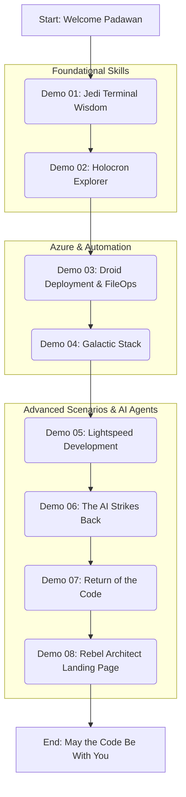

# 🚀 GitHub Copilot & GitHub Copilot for Azure: The Code Awakens Demo Guide

> **🎯 Purpose**: This comprehensive guide covers 8 hands-on Star Wars-themed demos showcasing GitHub Copilot's capabilities, GitHub Copilot for Azure integration, and the new agent mode for technical audiences. This document serves as the primary reference for understanding the structure, objectives, and execution of each demonstration.
> **Audience**: Technical professionals, developers, cloud architects, and anyone interested in leveraging AI-powered tools for enhanced productivity and exploring Azure best practices.

## 📋 Table of Contents

- [🚀 GitHub Copilot \& GitHub Copilot for Azure: The Code Awakens Demo Guide](#-github-copilot--github-copilot-for-azure-the-code-awakens-demo-guide)
  - [📋 Table of Contents](#-table-of-contents)
  - [🔍 Overview](#-overview)
  - [🌌 The Force Flow: Demo Structure](#-the-force-flow-demo-structure)
  - [💻 Demo 01: Jedi Terminal Wisdom](#-demo-01-jedi-terminal-wisdom)
  - [🌐 Demo 02: Holocron Explorer](#-demo-02-holocron-explorer)
  - [🛠️ Demo 03: Droid Deployment \& The Force of FileOps](#️-demo-03-droid-deployment--the-force-of-fileops)
    - [Part A: Azure Extension - Deploying with the Force](#part-a-azure-extension---deploying-with-the-force)
    - [Part B: File Operations Script - Mastering the Data Flow](#part-b-file-operations-script---mastering-the-data-flow)
  - [🗄️ Demo 04: Galactic Stack - N-Tier App Modernization](#️-demo-04-galactic-stack---n-tier-app-modernization)
  - [🏗️ Demo 08: Rebel Architect Landing Page](#️-demo-08-rebel-architect-landing-page)

---

## 🔍 Overview

This guide provides a structured walkthrough of 8 Star Wars-themed demos, each meticulously designed to highlight a unique capability of GitHub Copilot and its powerful integration with GitHub Copilot for Azure. The demos are crafted to progressively build in complexity, starting from fundamental command-line assistance and culminating in sophisticated full-stack cloud deployment scenarios. Throughout this journey, the emphasis is squarely on boosting developer productivity, streamlining automation, and adhering to Azure best practices.

The primary **purpose** of this demo series is to illustrate how AI-driven tools can revolutionize the software development lifecycle. From understanding complex codebases to deploying and managing intricate cloud architectures, GitHub Copilot acts as an intelligent assistant, empowering users to achieve more with greater efficiency.

**Key Benefits Showcased:**
- **Accelerated Developer Productivity**: Witness firsthand how AI assistance can significantly reduce development time and effort.
- **Streamlined Cloud Deployment Workflows**: Explore intelligent automation for deploying applications to Azure with ease.
- **Intelligent Architecture Recommendations**: Leverage AI to receive insightful suggestions for robust and scalable cloud solutions.
- **Automated Code Generation and Refactoring**: Discover how Copilot can write and refactor code, allowing developers to focus on higher-level design.
- **Azure Best Practices Implementation**: Learn how to seamlessly integrate Azure's recommended practices into your development and deployment processes.

---

## 🌌 The Force Flow: Demo Structure

This section outlines the overall structure and flow of the demos. Each demo is a self-contained module focusing on specific GitHub Copilot features.



**Structure Explanation:**

*   **Foundational Skills (Demos 01-02):** These initial demos focus on core GitHub Copilot functionalities, such as explaining terminal commands and understanding repository structures. They lay the groundwork for more complex scenarios.
*   **Azure & Automation (Demos 03-04):** This block showcases GitHub Copilot for Azure, demonstrating its capabilities in guiding Azure deployments and generating automation scripts.
*   **Advanced Scenarios & AI Agents (Demos 05-08):** The later demos delve into more advanced use cases, including rapid application development, AI-powered refactoring, and leveraging agent mode for complex problem-solving and content generation.

Each demo description will detail its specific **Mode** (Ask, Edit, Agent), **Prompts**, **Expected Output**, **Purpose**, and **Key Capability** being highlighted.

---

## 💻 Demo 01: Jedi Terminal Wisdom

**Mode**: Ask mode (CLI)

**Prompt**:
```bash
gh copilot explain sudo apt-get
```

**Expected Output**:
A clear, concise explanation of the `sudo apt-get` command, detailing its purpose, common parameters (like `update`, `upgrade`, `install`, `remove`), and typical use cases in natural language. The explanation should be easy for a developer to understand, even if they are not deeply familiar with Linux package management.

**Purpose**:
To demonstrate how GitHub Copilot CLI can demystify complex shell commands, enhancing developer understanding and confidence when working in the terminal. This showcases Copilot's ability to interpret and explain common command-line operations that developers encounter daily, acting as an instant "Jedi Master" for terminal commands.

**Key Capability**: Command interpretation and contextual explanations for CLI operations.

---

## 🌐 Demo 02: Holocron Explorer

**Mode**: Ask mode (Web Interface / IDE)

**Prompts**:
1.  `explain repository` (after opening a project)
2.  `fix code` (when a problematic code snippet is identified or selected)

**Expected Output**:
1.  **Repository Explanation**: A comprehensive overview of the current repository, highlighting its main purpose, key directories, primary technologies used, and potential entry points or important files.
2.  **Code Fix**: Identification of issues in the selected code (e.g., syntax errors, logical flaws, potential bugs, or style inconsistencies) and a proposed, corrected version of the code with a clear explanation of the changes made.

**Purpose**:
To showcase GitHub Copilot's capabilities within a web interface or IDE for rapid repository exploration and intelligent, automated code correction. This demonstrates how Copilot helps developers quickly understand unfamiliar codebases and efficiently identify and resolve code problems, much like a Holocron provides ancient Jedi knowledge.

**Key Capability**: Repository understanding, code analysis, and automated code fixing with explanations.

---

## 🛠️ Demo 03: Droid Deployment & The Force of FileOps

This demo is split into two parts, showcasing both Azure deployment assistance and advanced scripting.

### Part A: Azure Extension - Deploying with the Force

**Mode**: Ask mode (IDE with Azure Extension)

**Prompts**:
```
Could you help me create and deploy a simple Flask website by using an azd template?
@azure Before I execute azd init, what does it do?
@azure What resources are created with this template?
@azure Are there any cost-saving tips for running this app on Azure?
@azure how can i make this application highly available?
@azure How do I undeploy this website?
```

**Expected Output**:
1.  **Deployment Guidance**: Step-by-step instructions on initializing an `azd` template for a Flask website, deploying it to Azure, and verifying the deployment.
2.  **`azd init` Explanation**: A clear description of the `azd init` command's function, including how it sets up the local environment and prepares for Azure deployment.
3.  **Resource Breakdown**: An explanation of the Azure resources (e.g., App Service, Resource Group, potentially a Container Registry or App Service Plan) that the chosen `azd` template will provision, along with their roles.
4.  **Cost Optimization**: Actionable tips for minimizing Azure costs for the deployed Flask app (e.g., choosing appropriate service tiers, scaling strategies, using Azure Advisor).
5.  **High Availability**: Suggestions for enhancing the Flask application's availability on Azure (e.g., deploying to multiple regions, using Azure Front Door, configuring auto-scaling).
6.  **Undeployment Steps**: Clear instructions on how to tear down the deployed resources using `azd down` or Azure portal/CLI commands.

### Part B: File Operations Script - Mastering the Data Flow

**Mode**: Ask mode, Edit mode (IDE or Web)

**Prompts**:
```
I need 1 powershell script to create 100 random folders with 100 random files; file size must vary between a few kb to a max 50mb.
I need another powershell script to automate file operations such as copying, moving, deleting, compressing, and extracting while capturing metrics for each operation, including duration, data size, and throughput. Operations should be split into 2 options - 1 for copying, moving, deleting; 2 for compressing, and extracting.
```

**Expected Output**:
Two complete and functional PowerShell scripts:
1.  **Random Data Generator Script**: A script that creates 100 uniquely named folders, each containing 100 uniquely named files. The files should have random content and sizes varying from a few kilobytes up to a maximum of 50MB.
2.  **File Operations & Metrics Script**: A script that provides a menu or parameters for two sets of operations:
    *   Option 1: Copying, moving, and deleting files/folders (user specifies source/destination).
    *   Option 2: Compressing files/folders into an archive and extracting archives (user specifies source/destination).
    For each operation performed, the script should capture and output metrics: duration of the operation, total data size processed, and calculated throughput (e.g., MB/second).

**Purpose**:
To demonstrate GitHub Copilot for Azure's comprehensive assistance with cloud deployment workflows (Part A) and its advanced PowerShell scripting capabilities for complex automation tasks (Part B). This showcases how Copilot can act as a knowledgeable assistant for both cloud infrastructure interactions and sophisticated script development, like a versatile droid handling both deployment and data management.

**Key Capability**: Cloud deployment guidance (Azure-specific), automation script generation (PowerShell), and complex logic implementation.

---

## 🗄️ Demo 04: Galactic Stack - N-Tier App Modernization

**Mode**: Ask mode, Agent mode (IDE with Azure Extension, potentially Web for research)

**Prompts**:
```
git clone https://github.com/Azure-Samples/azure-sql-db-django
@azure Please recommend Azure services for my project. (Initial check with the cloned Django app)
@azure Please use Azure App Service instead of Azure Container App for my project. (If Container App was initially suggested)
@azure Why would I use Azure Cosmos DB instead of Azure SQL for this Django application?
@azure Can you help me modify the Django application to replace the SQL DB with Azure Cosmos DB (NoSQL)? This will involve changing models, views, and settings.
@azure The SERVICE_URL environment variable in my Azure App Service settings should be updated to 'https://www.bing.com'. Also, please add a new environment variable STAGE=dev to my project's Azure configuration.
@azure Let's use GitHub to deploy my app to Azure. Set up a GitHub Actions pipeline to deploy my app to Azure App Service.
```

**Reminders**:
- ⚠️ **Switch model if necessary!** (For more comprehensive architecture recommendations or complex code generation, a more advanced model might be beneficial).
- ⚠️ **Switch to agent mode** (For multi-step problem-solving like database migration and pipeline setup, agent mode will be crucial).

**Additional Prompt (Illustrative - can be part of the agent-driven flow)**:
```
Update the README.md file for this project. It should include:
- A brief overview of the project (Django app now using Cosmos DB).
- Setup instructions for local development.
- Deployment instructions using the new GitHub Actions pipeline.
- A Mermaid diagram illustrating the new architecture (App Service -> Cosmos DB).
```

**Expected Output**:
1.  **Initial Azure Service Recommendations**: Suggestions for hosting the Django app (e.g., App Service, Container Apps, AKS) and its database (e.g., Azure SQL DB, Flexible Server for PostgreSQL/MySQL).
2.  **Cosmos DB Rationale**: A clear explanation of the benefits of using Azure Cosmos DB (e.g., scalability, schema flexibility, global distribution, multi-model capabilities) compared to Azure SQL for a Django application, and potential trade-offs.
3.  **Code Modification Guidance (SQL to Cosmos DB)**:
    *   Assistance in identifying necessary changes in `models.py` (e.g., adapting Django ORM or using a Cosmos DB SDK).
    *   Guidance on updating `views.py` to interact with Cosmos DB.
    *   Help with modifying `settings.py` for Cosmos DB connection strings and configurations.
    *   (Agent mode would iteratively help apply these changes).
4.  **Environment Variable Configuration**: Confirmation or guidance on how to update/add environment variables in Azure App Service (e.g., via Azure portal, Azure CLI, or `azd` if applicable).
5.  **GitHub Actions Pipeline**: A generated YAML workflow file for GitHub Actions that:
    *   Checks out the code.
    *   Sets up Python and Django.
    *   Logs into Azure.
    *   Deploys the application to the specified Azure App Service.
    *   (Agent mode would help create and commit this file).
6.  **Updated README.md**: A revised README file incorporating the requested information and a Mermaid diagram like:
    ```mermaid
    graph LR
        User --> AppService[Azure App Service];
        AppService --> CosmosDB[Azure Cosmos DB];
        GitHubActions[GitHub Actions] --> AppService;
    end
    ```

**Purpose**:
To demonstrate GitHub Copilot's advanced capabilities in handling a multi-step application modernization scenario. This includes:
-   Providing intelligent Azure service recommendations.
-   Explaining complex architectural choices (SQL vs. NoSQL).
-   Assisting with significant code refactoring (database migration).
-   Managing Azure configurations.
-   Automating CI/CD pipeline creation.
-   Generating comprehensive documentation.
This demo highlights the power of agent mode for tackling complex, iterative development tasks, transforming a traditional N-Tier application into a more modern, cloud-native solution.

**Key Capability**: Cloud architecture recommendations, database migration assistance, code refactoring, CI/CD pipeline generation (GitHub Actions), environment configuration, and technical documentation.

---

## 🏗️ Demo 08: Rebel Architect Landing Page

**Mode**: Agent mode

**Prompt**:
```
Describe a landing page for cloud architects in simple MVP (Minimum Viable Product) terms.
The page should be targeted at experienced cloud architects and focus on providing high-value, technical content.
Key sections should include:
1.  Hero section with a clear value proposition for architects.
2.  A section showcasing downloadable 'Reference Architecture Blueprints' (e.g., for microservices on AKS, serverless event-driven architectures).
3.  A 'Technical Deep Dive' blog/article feed.
4.  A 'Tools & IaC Samples' section (e.g., links to GitHub repos with Bicep/Terraform templates).
5.  A simple, no-fluff contact/engagement form.
Outline the content strategy for each section, keeping the technical audience in mind.
Suggest 2-3 key call-to-actions (CTAs).
What are 3 design considerations for such a page?
```

**Expected Output**:
A comprehensive description and outline of an MVP landing page targeted specifically at cloud architects, including:

*   **Overall MVP Concept**:
    *   Focus: "Empowering Cloud Architects with Actionable Insights and Production-Ready Resources."
    *   Tone: Technical, direct, value-driven.
*   **Essential Sections & Content Strategy**:
    1.  **Hero Section**:
        *   Headline: e.g., "Architect the Future: Advanced Cloud Solutions & Expert Resources."
        *   Sub-headline: e.g., "Access proven blueprints, deep-dive analyses, and cutting-edge IaC for your most complex cloud challenges."
        *   Primary CTA: e.g., "Explore Blueprints" or "Get Technical Guides."
    2.  **Reference Architecture Blueprints**:
        *   Content: Curated list of 3-5 downloadable architecture diagrams (e.g., PNG/SVG, Visio files) with brief descriptions and links to detailed explanations or accompanying IaC. Examples: "Scalable Microservices on Azure Kubernetes Service," "Resilient Serverless Architectures," "Secure Hybrid Cloud Connectivity."
        *   Focus: Practical, immediately usable patterns.
    3.  **Technical Deep Dive (Blog/Articles)**:
        *   Content: Titles and brief summaries of 3-4 recent, in-depth articles. Examples: "Optimizing Azure Costs for Large-Scale Deployments," "Advanced Networking Patterns in Azure," "Comparing Orchestration Options: AKS vs. ACA vs. Service Fabric."
        *   Focus: Expert insights, problem-solving, emerging technologies.
    4.  **Tools & IaC Samples**:
        *   Content: Links to 2-3 GitHub repositories or curated lists of Bicep, Terraform, or ARM templates for common Azure scenarios. Examples: "IaC for Secure Landing Zones," "Automated API Management Deployment."
        *   Focus: Reusable code, best practices in infrastructure automation.
    5.  **Engage with Our Experts (Contact/Engagement)**:
        *   Content: Minimalist form (Name, Email, Brief Inquiry).
        *   Headline: e.g., "Discuss Your Architecture Challenge" or "Connect with Principal Architects."
        *   Focus: Low-friction, direct access to expertise.
*   **Call-to-Action (CTA) Recommendations**:
    1.  "Download Architecture Blueprints" (High-value content lead).
    2.  "Read Technical Deep Dives" (Thought leadership engagement).
    3.  "Access IaC Samples on GitHub" (Practical resource utilization).
*   **Design Considerations for a Developer/Architect Audience**:
    1.  **Performance & Clarity**: Prioritize fast load times and a clean, uncluttered UX. Use a minimalist design that emphasizes content over excessive graphics.
    2.  **Information Density & Scannability**: Structure content for easy scanning with clear headings, bullet points, and code snippets (if applicable). Architects value quick access to relevant information.
    3.  **Credibility & Technical Accuracy**: Ensure all content is technically accurate, up-to-date, and reflects current best practices. Links to official documentation or reputable sources are beneficial. Dark mode option often appreciated.

**Purpose**:
To demonstrate how GitHub Copilot, especially in agent mode, can generate specialized technical content and strategic outlines that address the specific needs and expectations of a highly technical audience like cloud architects. This showcases Copilot's understanding of technical content design, value proposition articulation for experts, and MVP principles for focused product development.

**Key Capability**: Technical content generation, strategic outlining, audience-specific communication, MVP definition, and understanding of design principles for technical users.
